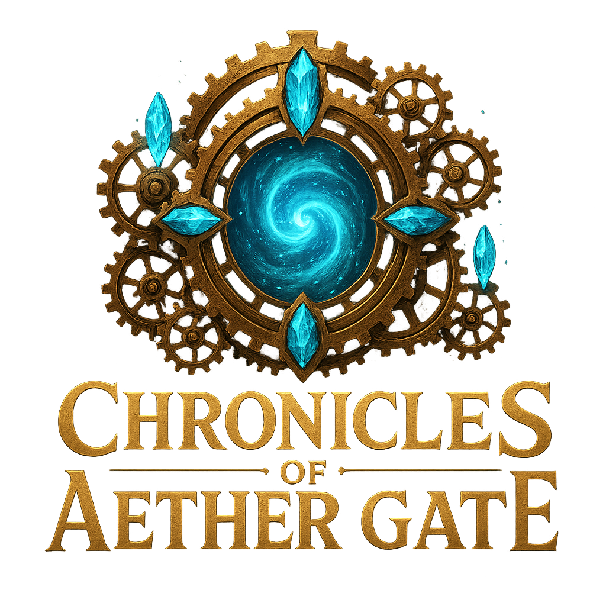

# 🎮 Chronicles of Aether Gate

A professional steampunk text adventure RPG built with Python and Tkinter, featuring strategic turn-based combat, comprehensive inventory management, and a complete save/load system.



## 🎯 Overview

Chronicles of Aether Gate is a fully-featured RPG adventure game where players explore a mysterious steampunk facility to collect Aether Crystals and unlock a dimensional gateway. The game combines classic text adventure elements with modern GUI design and strategic combat mechanics.

## ✨ Features

### 🗺️ **Rich Game World**
- **5 unique locations** with custom artwork and detailed descriptions
- **Interconnected room system** with logical navigation
- **Environmental storytelling** through room descriptions and items

### ⚔️ **Strategic Combat System**
- **Turn-based combat** with speed-based initiative
- **Enemy AI** with different behavioral patterns (aggressive, defensive, tactical)
- **Player abilities** with Focus point resource management
- **Status effects** and temporary buffs/debuffs
- **Equipment modifiers** affecting combat stats

### 🎒 **Comprehensive Item System**
- **Multiple item types**: Weapons, Accessories, Consumables, Key Items
- **Equipment stats** that modify player capabilities
- **Professional inventory GUI** with tooltips and item details
- **Item rarity system** with visual indicators

### 💾 **Complete Save/Load System**
- **Multiple save slots** with metadata display
- **Auto-save functionality** after major events
- **Save file management** with delete and organization features
- **JSON-based persistence** for reliable data storage

### 🏆 **Achievement & Victory System**
- **Multiple victory conditions** beyond the main objective
- **Achievement tracking** for different play styles
- **Comprehensive statistics** tracking player progress
- **Victory variations** based on player performance

### 🎨 **Professional UI/UX**
- **Modern GUI design** using ttkbootstrap styling
- **Intuitive navigation** with visual feedback
- **Professional main menu** with game options
- **Comprehensive help system** with full game guide

## 🛠️ Technical Architecture

### **Technologies Used**
- **Python 3.12** - Core programming language
- **Tkinter** - GUI framework
- **ttkbootstrap** - Modern UI styling
- **Pillow (PIL)** - Image processing
- **JSON** - Data persistence

## Code Organization

```text
chronicles_of_aethergate/
├── launcher.py         # Game launcher and main menu
├── main.py             # Main game controller
├── models/             # Data models
│   ├── player.py       # Player character system
│   ├── enemy.py        # Enemy classes and AI
│   ├── item.py         # Item system
│   ├── room.py         # Room model
│   └── __init__.py
├── engine/             # Game logic
│   ├── world_loader.py # Data loading utilities
│   ├── combat.py       # Combat engine
│   ├── item_manager.py # Item management
│   ├── save_load.py    # Save/load system
│   ├── victory.py      # Victory conditions
│   ├── sound_manager.py# Audio system
│   └── __init__.py
├── ui/                 # User interface
│   ├── gui.py          # Main game GUI
│   ├── main_menu.py    # Title screen
│   ├── combat_gui.py   # Combat interface
│   ├── inventory_gui.py# Inventory management
│   ├── save_load_gui.py# Save/load interface
│   ├── dialog.py       # Dialogs and popups
│   └── theme/          # Theming and custom widgets
│       ├── theme_engine.py
│       ├── widgets.py
│       ├── effects.py
│       ├── additional_widgets.py
│       └── __init__.py
├── data/               # Game assets
│   ├── rooms.json      # Room definitions
│   ├── enemies.json    # Enemy data
│   ├── items.json      # Item database
│   ├── images/         # Game artwork
│   └── sounds/         # Sound effects and music
├── saves/              # Save game files
├── tests/              # Test suite
├── requirements.txt    # Runtime dependencies
├── dev-requirements.txt# Development dependencies
├── .gitignore          # Git ignore rules
└── README.md           # Project documentation
```

## 🚀 Getting Started

### **Prerequisites**
- Python 3.12 or higher
- Required packages (install via pip):

pip install ttkbootstrap pillow


### **Installation**
1. Clone or download the game files
2. Navigate to the game directory
3. Install dependencies:

pip install -r requirements.txt

For development (tests and tools):

pip install -r dev-requirements.txt


### **Running the Game**
```bash
python launcher.py
```

**Note**: The game opens in maximized window mode for optimal visibility of all UI elements.

### Optional: Audio Assets
- The game can generate simple tones automatically, but you can add richer sounds.
- Place CC0 or licensed sound files into `data/sounds/` with these names:
  - `menu.(wav|ogg)`, `pickup.(wav|ogg)`, `attack.(wav|ogg)`, `heal.(wav|ogg)`, `victory.(wav|ogg)`, `defeat.(wav|ogg)`
- You can also auto-download your sounds using the helper (requires `requests`):
  ```bash
  pip install requests
  cp tools/sounds.json.example tools/sounds.json
  # Edit tools/sounds.json and paste direct file URLs (CC0 or licensed)
  python tools/fetch_sounds.py
  ```
  The game will always prefer files found in `data/sounds/` over generated tones.

### Background Music (Loop)
- You may add a background music track that loops during the launcher and game:
  - Place your music file at: `data/sounds/background.mp3`
  - Volume defaults to 40% and loops continuously
  - Requires `pygame` for playback

Recommended track provided by you:
- Incredulity by Scott Buckley | www.scottbuckley.com.au
- Music promoted by https://www.chosic.com/free-music/all/
- Creative Commons CC BY 4.0: https://creativecommons.org/licenses/by/4.0/
- Direct file (example): https://www.chosic.com/wp-content/uploads/2025/05/Incredulity-chosic.com_.mp3

Attribution (example to include in your project):
"Incredulity" by Scott Buckley (www.scottbuckley.com.au) is licensed under CC BY 4.0. Music via Chosic (https://www.chosic.com/free-music/all/). License: https://creativecommons.org/licenses/by/4.0/

### Testing

Run the test suite:

```bash
pytest -q
```

Manual GUI harness lives under `dev_tests/` and is excluded from pytest collection.


## 🎮 How to Play

### **Basic Controls**
- **Navigation**: Use arrow buttons to move between rooms
- **Combat**: Click Fight when enemies are present
- **Inventory**: Manage items, equipment, and consumables
- **Save/Load**: Preserve progress across sessions
- **Keyboard Shortcuts**: 
  - `Ctrl+I` - Open Inventory
  - `Ctrl+S` - Save Game
  - `Ctrl+L` - Load Game
  - `Ctrl+H` - Show Help
  - `F` - Fight (when enemies present)
  - `T` - Take Item (when items available)

### **Objective**
Explore the Aether Gate facility and collect 3 Aether Crystals to unlock the dimensional gateway. Fight mechanical guardians, discover powerful equipment, and uncover the mysteries of this ancient technology.

### **Combat Tips**
- **Equipment matters**: Weapons and accessories significantly impact your stats
- **Manage resources**: Focus points enable powerful abilities
- **Enemy patterns**: Learn AI behaviors to predict and counter attacks
- **Consumables**: Use healing items strategically during tough fights

## 🏆 Achievements

- **Crystal Master**: Collect all 3 Aether Crystals
- **Explorer**: Visit every room in the facility
- **Warrior**: Defeat multiple enemies in combat
- **Untouchable**: Complete the game without taking damage
- **Tactical Genius**: Minimize damage taken through smart play

## 📊 Game Statistics

The game tracks comprehensive statistics including:
- Rooms explored
- Enemies defeated
- Damage dealt and received
- Items collected
- Play time and efficiency

## 🔧 Development Notes

This project demonstrates:
- **Object-oriented design** with clear separation of concerns
- **Event-driven GUI programming** with proper state management
- **Data persistence** using JSON serialization
- **Game AI implementation** with behavioral patterns
- **Professional software architecture** suitable for larger projects

## 📝 Credits

**Development**: Complete game design and implementation  
**Technology Stack**: Python, Tkinter, ttkbootstrap, Pillow  
**Art Assets**: AI-generated illustrations and icons  
**Game Design**: Original steampunk RPG concept  

## 📦 Publishing Notes

- Runtime requirements are minimized in `requirements.txt`.
- Development-only tooling (pytest, etc.) is in `dev-requirements.txt`.
- A `.gitignore` prevents committing caches, venvs, and save files (except the example autosave).

## 📄 License

This project is created as a portfolio demonstration of Python GUI development and game programming skills.

---

**Chronicles of Aether Gate** - *Where Steam Meets Magic* ⚙️🔮